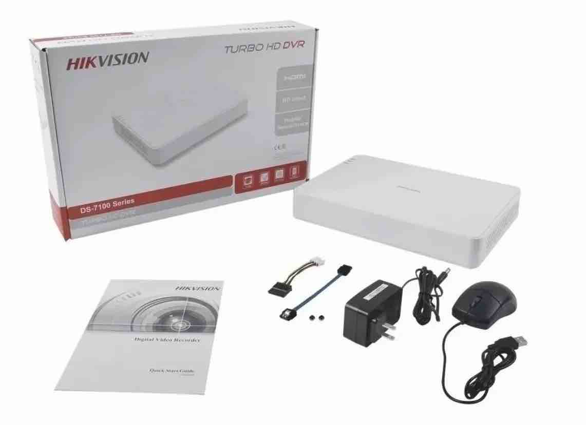
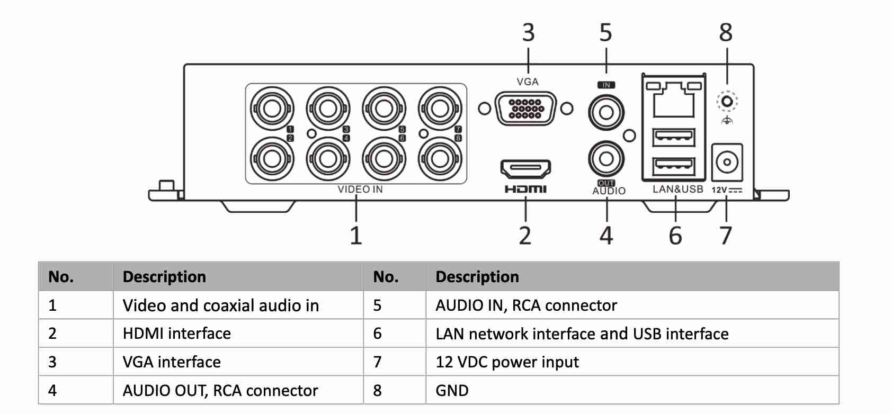

**Departamento de Engenharia Elétrica do CEFET-MG Campus NG**

**Coordenação do Curso Técnico de Eletrotécnica**

**Laboratório de Instalações Elétricas Prediais - PLIEP**

**Aula Prática – Sistemas de Circuito Fechado de Televisão (CFTV)**

### Carga Horária
2 horas-aula

---

### 🎯 Objetivo Geral
Proporcionar aos alunos uma compreensão abrangente dos **Sistemas de Circuito Fechado de Televisão (CFTV)**, abordando desde seus princípios de funcionamento até as tecnologias mais recentes, capacitando-os para aplicar esse conhecimento em situações reais de segurança eletrônica.

---

### 🎯 Objetivos Específicos
- Reconhecer os componentes básicos de um sistema de CFTV.  
- Compreender os diferentes **tipos de câmeras analógicas e IP**, seus recursos e aplicações.  
- Identificar as **formas de cabeamento (coaxial e UTP)** e suas características técnicas.  
- Diferenciar os equipamentos de gravação **DVR** e **NVR**, compreendendo seu funcionamento e aplicação.  
- Explorar as inovações tecnológicas que impactam o CFTV, como IA, IoT e armazenamento em nuvem.  
- Desenvolver habilidades práticas para instalação e configuração de sistemas de CFTV.  

---

### Competências e Habilidades
**Competências:**
- Instalar e configurar sistemas de segurança eletrônica.  
- Analisar o funcionamento e desempenho de sistemas de CFTV.  
- Aplicar normas técnicas e boas práticas de cabeamento estruturado.  

**Habilidades:**
- Montar e testar redes coaxiais e UTP.  
- Configurar câmeras analógicas e IP.  
- Operar DVRs e NVRs com software de gestão.  
- Identificar falhas e realizar manutenção preventiva.

---

### Introdução
O **Circuito Fechado de Televisão (CFTV)** é um sistema de vigilância eletrônica que utiliza câmeras conectadas a monitores e gravadores, permitindo o monitoramento de ambientes de forma restrita e controlada.  
Com o avanço da tecnologia, o CFTV evoluiu de sistemas **analógicos com cabos coaxiais** para **sistemas digitais baseados em rede IP**, integrando-se à **Internet das Coisas (IoT)** e à **Inteligência Artificial (IA)**.  
Nesta aula, os alunos irão compreender os princípios de funcionamento, os componentes essenciais, os tipos de câmeras, os meios de transmissão de sinal e as boas práticas de instalação e manutenção.

---

### Conteúdo Programático

#### 1. Fundamentos do CFTV

O **Circuito Fechado de Televisão (CFTV)** é um **sistema eletrônico de aquisição, transmissão, processamento e exibição de imagens** destinado ao monitoramento de ambientes internos ou externos de forma controlada. Trata-se de um subsistema amplamente empregado em **infraestruturas de segurança eletrônica e automação predial**, cuja principal característica é o **acesso restrito** às imagens captadas, diferindo fundamentalmente das transmissões públicas de televisão.

O CFTV é composto, em sua essência, por **câmeras de vigilância**, **meios de transmissão de sinal (cabeamento ou rede IP)**, **dispositivos de gravação (DVR ou NVR)** e **monitores de visualização**. Cada elemento desempenha uma função técnica específica, garantindo a integridade do sinal, a qualidade da imagem e a disponibilidade contínua das informações captadas.

#### **Conceito e Diferença entre Circuito Aberto e Circuito Fechado**

Do ponto de vista técnico, o termo “**circuito fechado**” indica que o sistema opera em uma **rede de comunicação isolada e controlada**, sem difusão pública do sinal.  
Essa característica proporciona **segurança de dados, estabilidade de transmissão e privacidade operacional**.

- **Circuito Aberto:** refere-se à transmissão livre de sinais audiovisuais, como na televisão convencional ou streaming pela internet, onde o conteúdo é amplamente acessível.  
- **Circuito Fechado:** consiste em um conjunto de dispositivos interconectados (câmeras, gravadores, monitores e servidores) que compartilham o sinal exclusivamente entre si, formando uma malha privada de comunicação.  

Em sistemas modernos, esse “fechamento” pode ser físico (cabos coaxiais dedicados) ou lógico (rede IP segmentada e protegida por protocolos de autenticação e criptografia).  
A topologia do sistema pode variar entre **ponto a ponto, estrela ou rede híbrida**, dependendo da infraestrutura e da complexidade do projeto.

#### **Finalidades Técnicas e Operacionais do CFTV**

O CFTV tem como objetivo principal **aumentar a capacidade de supervisão e controle sobre ambientes e processos**, servindo como uma ferramenta de apoio à **segurança patrimonial, industrial e operacional**.

Principais aplicações técnicas:
- **Vigilância e monitoramento contínuo:** captação e gravação de imagens em tempo real, com possibilidade de análise posterior para auditorias ou investigações.  
- **Controle de acesso e identificação:** integração com sistemas biométricos, leitores RFID e catracas para validação de entrada e saída de pessoas.  
- **Automação e resposta a eventos:** acionamento automático de alarmes, sirenes, luzes ou bloqueios quando padrões de movimento são detectados.  
- **Análise operacional:** acompanhamento de processos industriais, linhas de produção e áreas críticas, permitindo otimização de desempenho e segurança.  
- **Supervisão remota:** monitoramento de filiais, subestações ou áreas externas por meio de redes IP seguras e conexões criptografadas.  
- **Registro e arquivamento técnico:** armazenamento das imagens em mídias digitais (HD, SSD, NAS ou nuvem) para fins de rastreabilidade e conformidade normativa.

####  **Importância do CFTV na Segurança Eletrônica**

Sob a ótica da engenharia elétrica e de sistemas, o CFTV representa a convergência entre **eletrônica, telecomunicações e tecnologia da informação**.  
A correta implementação do sistema envolve:
- **dimensionamento elétrico e eletrônico dos componentes;**
- **seleção adequada de câmeras conforme luminosidade e resolução;**
- **especificação do meio de transmissão (coaxial ou UTP);**
- **configuração de gravação, rede e armazenamento.**

Além do aspecto técnico, é indispensável a observância às **normas de privacidade, proteção de dados e regulamentações de segurança**, como a **Lei Geral de Proteção de Dados (LGPD)**, que impõe diretrizes para o uso ético das imagens.

---

### 2. Formas de Cabeamento

O cabeamento é essencial para garantir a qualidade da imagem e a estabilidade da comunicação entre câmeras e gravadores.

#### Cabo Coaxial
- Utilizado principalmente em sistemas analógicos (DVR).  
- Transmite sinal de vídeo composto.  
- Tipos comuns: **RG59** e **RG6**.  
- Conector: **BNC**.  
- Pode incluir alimentação integrada (cabo 3 em 1).  

#### Cabo UTP (Unshielded Twisted Pair)
- Utilizado em sistemas de câmeras IP e também em analógicas com baluns.  
- Categorias mais usadas: **Cat5e** e **Cat6**.  
- Permite transmissão de dados e alimentação via **PoE (Power over Ethernet)**.  
- Conectores: **RJ45**.  
- Vantagens: menor custo, flexibilidade e facilidade de instalação.
  
#### Crimpar e testar o  conector RJ45 

[Ver guia de montagem e teste de conector RJ-45](https://github.com/Epaminondaslage/PLIEP-PBXIP/blob/main/Crimpar-conector-RJ-45.md)

---

### 3. Tipos de Câmeras

As câmeras são o núcleo do sistema de CFTV e variam conforme a tecnologia, design e recursos.

#### Câmeras Analógicas
- Conectadas via cabo coaxial.  
- Requerem DVR para gravação.  
- Resolução limitada (SD a Full HD).  
- Modelos: **Dome**, **Bullet**, **PTZ (Pan-Tilt-Zoom)**.  
- Usadas em sistemas locais e de menor custo.  

#### Câmeras IP (Internet Protocol)
- Conectadas via rede de dados (UTP).  
- Requerem NVR para gravação e gerenciamento.  
- Transmitem vídeo digital em alta definição (até 4K).  
- Possuem recursos inteligentes: detecção de movimento, reconhecimento facial, visão noturna avançada.  
- Permitem acesso remoto via navegador ou aplicativo móvel.  

---

### 4. Equipamentos de Gravação

Os gravadores são responsáveis por armazenar, processar e disponibilizar as imagens captadas pelas câmeras.

#### DVR (Digital Video Recorder)
- Utilizado em sistemas **analógicos**.  
- Conecta-se às câmeras por cabo coaxial.  
- Converte o sinal analógico para digital e armazena em HD interno.  
- Oferece funções de gravação, reprodução, busca e exportação de vídeos.  
- Alguns modelos possuem acesso remoto via internet.  

#### NVR (Network Video Recorder)
- Utilizado em sistemas **IP**.  
- Conecta-se às câmeras via rede (Ethernet).  
- Recebe os sinais já digitalizados.  
- Suporta gravação em alta resolução e múltiplos canais IP.  
- Integra-se a redes PoE e armazenamento em nuvem.

---

## **Características do DVR hibrido Hikvision s DS-7108HGHI-K1**

| **Item** | **Descrição** |
|-----------|----------------|
| **Marca** | Hikvision |
| **Modelo** | DS-7108HGHI-K1 (S) |
| **Quantidade de canais** | 8 |
| **Resolução máxima de vídeo** | 1080n |
| **Tipo de resolução** | Lite |
| **Conectores de saída** | VGA, HDMI, RCA |
| **Inclui HD** | Não |
| **Conectores de entrada** | HD-TVI, HD-CVI, AHD, Analógico (CVBS), IP |
| **Capacidade de armazenamento** | 4 TB |
| **Tipos de controle** | Mouse |
| **Sistemas operativos compatíveis** | Android, iOS |
| **Quantidade de portas PoE** | 1 |
| **Com vídeo ao vivo** | Sim |
| **Com áudio bidirecional** | Sim |
| **Com sensor de movimento** | Sim |
| **Formatos de compressão de vídeo** | H.264, H.265, H.264+, H.265 Pro, H.265 Pro+ |
| **Modos de gravação** | Detecção de movimento |

---

### 5. **Evolução Tecnológica e Integração**

Os sistemas de **CFTV modernos** evoluíram significativamente com o avanço da tecnologia digital, passando de soluções isoladas de gravação local para plataformas inteligentes e integradas com outros sistemas de segurança e automação. Essa evolução trouxe ganhos expressivos em desempenho, segurança, conectividade e análise inteligente das imagens.

#### **Inteligência Artificial (IA)**
A introdução da **IA** nos sistemas de CFTV transformou a forma de monitorar e interpretar eventos.  
As câmeras e gravadores atuais utilizam **processamento de vídeo inteligente (IVA – Intelligent Video Analytics)** para reconhecer padrões e automatizar decisões.  
Principais aplicações:
- **Reconhecimento facial** para controle de acesso e identificação de indivíduos.  
- **Contagem de pessoas e veículos** em ambientes comerciais e industriais.  
- **Detecção de comportamento anômalo**, como movimentação fora de horário, aglomerações ou invasões de perímetro.  
- **Filtragem inteligente de eventos**, permitindo buscas rápidas em gravações com base em critérios como cor, tamanho ou direção do movimento.  

Esses recursos otimizam a vigilância, reduzem falsos alarmes e permitem respostas rápidas e automáticas.

---

#### **Internet das Coisas (IoT)**
Com a integração ao conceito de **IoT (Internet of Things)**, o CFTV passou a ser parte ativa de um ecossistema de dispositivos conectados.  
As câmeras IP modernas podem se comunicar com sensores, alarmes, controladores e sistemas de automação predial, criando uma rede inteligente de segurança.  
Exemplos de aplicações:
- **Acionamento automático de iluminação** ao detectar presença.  
- **Envio de alertas instantâneos** a aplicativos móveis ou centrais de monitoramento.  
- **Integração com sensores ambientais** (temperatura, fumaça, movimento).  
- **Controle remoto via interface web ou aplicativos móveis**, com ajustes e monitoramento em tempo real.  

A integração via protocolos como **MQTT, ONVIF e Modbus** permite a interoperabilidade entre dispositivos de diferentes fabricantes.

---

#### **Armazenamento e Monitoramento em Nuvem**
O uso da **computação em nuvem** revolucionou a forma como as imagens são armazenadas e acessadas.  
Antes restritos a discos rígidos locais, os sistemas atuais podem gravar e gerenciar vídeos remotamente com segurança e escalabilidade.  
Principais vantagens:
- **Acesso remoto** às imagens em tempo real de qualquer lugar.  
- **Backup automático** e redundância de dados.  
- **Redução de custos com infraestrutura física de armazenamento.**  
- **Atualizações automáticas de software e firmware.**  
- **Análise avançada baseada em IA** processada diretamente na nuvem.  

A nuvem também facilita a **centralização do monitoramento**, permitindo que diversas unidades ou filiais sejam supervisionadas de um único centro de controle.

---

#### **Integração com Automação Predial e Controle de Acesso**
O CFTV moderno não atua de forma isolada — ele faz parte de um sistema unificado de **gestão predial e segurança eletrônica**.  
A integração com sistemas de **automação predial** e **controle de acesso** permite:
- Sincronização entre câmeras e **leitores biométricos, catracas e fechaduras eletrônicas**.  
- **Geração de registros automáticos** (imagem + log de entrada/saída).  
- **Automação de respostas** — por exemplo, acionar alarmes sonoros, bloqueios de portas ou notificações instantâneas quando um evento é detectado.  
- **Visualização unificada** de todos os subsistemas (CFTV, alarmes, sensores, iluminação e climatização) em uma única interface de supervisão.  

Essa integração amplia o conceito de **edifício inteligente**, combinando **segurança, eficiência energética e conforto operacional**.

---

## Metodologia
1. Aula teórica com exposição dos conceitos.  
2. Demonstração prática de cabeamento coaxial e UTP.  
3. Montagem de um sistema com câmeras analógicas e IP.  
4. Configuração e teste de DVR e NVR em bancada.

---

## Recursos Didáticos
- Kit de CFTV (câmeras analógicas e IP, DVR, cabos, conectores).
- Configuração de app para acesso ao Sistema de CFTV
- Acesso à internet e rede local.  
- Projetor multimídia e quadro branco.  

---
##  **Parte Prática**

Nesta atividade, o aluno deverá **montar, configurar e testar um sistema completo de CFTV híbrido**, utilizando câmeras analógicas e IP, cabeamento adequado e integração com aplicativo de monitoramento móvel.  O objetivo é compreender na prática os **conceitos de instalação, conectividade e operação de sistemas de vigilância eletrônica**.

---

###  **Procedimentos**

1. **Montagem do Cabeamento Coaxial**  
   - Confeccionar e instalar **cabos coaxiais RG59** entre as **cinco câmeras analógicas** instaladas nos boxes e o **DVR Hikvision**.  
   - Certificar-se de que os conectores **BNC** estão corretamente prensados e identificados.  
   - Verificar continuidade e integridade dos cabos antes da conexão final.  

2. **Montagem do Cabeamento UTP**  
   - Montar e testar os **cabos UTP Categoria 5 ou superior** para interligação das **câmeras IP** à rede.  
   - Utilizar conectores **RJ45 padrão T568B** em ambas as extremidades.  
   - Garantir a correta fixação do cabo no rack ou ponto de rede designado.  

3. **Conexões Finais e Integração com o DVR**  
   - Conectar as **câmeras analógicas** às portas **BNC** do DVR.  
   - Conectar as **câmeras IP** e o **DVR** à **rede Ethernet** do laboratório.  
   - Verificar o **link de rede**, **alimentação** e **endereçamento IP** dos dispositivos.  

   

     
   

4. **Configuração do Aplicativo de Monitoramento**  
   - Baixar o aplicativo **Hik-Connect** (Hikvision) em seu smartphone.  
   - Certificar-se de que o celular está conectado à rede **Wi-Fi CEFET-Aluno** durante o download e instalação.
# 📘 **Guia de Inicialização e Configuração – DVR/NVR Hikvision**

## ⚙️ **Inicialização (Startup)**

Uma inicialização correta é essencial para **aumentar a vida útil do DVR/NVR** e garantir seu funcionamento adequado.

**Passo 1:** Conecte a **fonte de alimentação** do dispositivo a uma tomada elétrica.  
**Passo 2:** Pressione o **botão de energia** (em alguns modelos, localizado no painel frontal ou traseiro).  

> Após esse procedimento, o dispositivo iniciará o processo de inicialização automaticamente.

---

## 🔑 **Ativação do Dispositivo**

Antes da ativação, **nenhuma operação é permitida**.  
Na primeira vez que o equipamento for acessado, será necessário **definir uma senha de administrador (admin)** para ativação do sistema.  
A ativação também pode ser realizada via **navegador web, software SADP** ou **cliente Hikvision iVMS**.

**Passos para ativar o dispositivo:**
1. Insira uma **nova senha** e confirme-a.  
2. *(Opcional)* Configure um **e-mail de recuperação**, **Hik-Connect**, **perguntas de segurança** ou **exporte o GUID** para redefinição de senha futura.  
3. Configure a senha para **ativar as câmeras IP** conectadas ao dispositivo.  
4. Salve as configurações e **conclua a ativação**.

---

## **Configurações de Rede (Network Settings)**

Antes de operar o DVR/NVR em rede, é necessário **configurar corretamente os parâmetros de rede**.

**Passos:**
1. Acesse:  
   `Configuration > Network > General`  
   ou `System > Network > TCP/IP`  
   ou `System > System Settings > Network > Network > TCP/IP`.  
2. Configure os **parâmetros de rede** (IP, máscara, gateway e DNS).
   #### **Configurações de rede do DVR**

      | Parâmetro | Valor |
      |------------|--------|
      | **IP** | 10.240.240.30 |
      | **Gateway padrão** | 10.240.240.1 |
      | **Máscara de sub-rede** | 255.255.255.0 |
      | **Usuário** | admin |
      | **senha** | deecefet |
   
4. Salve as configurações.

---

## **Adicionar Câmeras IP (Add Network Camera)**

Antes de visualizar ou gravar vídeos, é necessário **adicionar as câmeras de rede (IP)** ao sistema.

**Passos:**
1. Acesse:  
   `Configuration > Camera`  
   ou `System > Device Access > Device > Video Device`.  
2. *(Opcional)* Em determinados modelos de DVR híbrido, defina o tipo de entrada de sinal (**analógico ou IP**).  
3. Clique em **IP Camera > Custom Add** ou **Add** em *Video Device*.  
4. Insira os **parâmetros de rede da câmera** (IP, porta, usuário e senha).  
5. Clique em **Add** para finalizar.

---

## **Configuração do Hik-Connect**

O **Hik-Connect** é um aplicativo e plataforma da Hikvision que permite **acesso remoto** e gerenciamento das câmeras via **smartphone**.

     
 

**Passos:**
1. Acesse:  
   `Configuration > Network > Hik-Connect`  
   ou `System > Network > Advanced > Platform Access`.  
2. **Habilite a função** e aceite os **termos de serviço**.  
3. Defina um **código de verificação (Verification Code)**.  
4. No smartphone, **escaneie o QR Code** e baixe o aplicativo **Hik-Connect**.  
5. No aplicativo, **escaneie o QR Code do dispositivo** e vincule-o à conta.  
6. *(Opcional)* Configure um **endereço de servidor personalizado (Server IP)**.  
7. *(Opcional)* Habilite a **criptografia de streaming** — será necessário inserir o código de verificação para acesso remoto.  
8. *(Opcional)* Habilite a **sincronização de horário** com o Hik-Connect em vez do servidor NTP.  
9. Salve as configurações.

---

## **Configuração de Gravação (Recording Settings)**

Antes de iniciar a gravação, certifique-se de que o **disco rígido (HDD)** está corretamente instalado ou adicionado ao sistema.  
Por padrão, o dispositivo grava continuamente (**Continuous / All-Day**) após a adição das câmeras.

**Para editar o agendamento de gravação:**
1. Acesse:  
   `Configuration > Record > Schedule`  
   ou `System > Storage Management > Storage Schedule > Video Recording`.  
2. Selecione a **câmera desejada**.  
3. Ative a função de **gravação**.  
4. Escolha o **tipo de gravação** (contínua, detecção de movimento, alarme, etc.) e ajuste o **calendário ou modelo de gravação**.  
5. Salve as configurações.

---

## **Reprodução (Playback)**

Os arquivos gravados no **disco rígido (HDD)** podem ser reproduzidos diretamente no DVR/NVR ou via software cliente.

**Passos:**
1. Acesse o menu **Playback**.  
2. Selecione uma ou mais **câmeras** na lista.  
3. Clique duas vezes na **data desejada** no calendário.  
4. Utilize a **barra de ferramentas inferior** para controlar a reprodução (play, pause, avanço rápido, captura de imagem, zoom digital, etc.).

> Consulte o manual do usuário para instruções detalhadas sobre os modos de reprodução disponíveis.
     
### 5. **Conexão ao Sistema Local do Laboratório**

- Alterar a conexão Wi-Fi do celular para a rede **DEE-Lab.Prediais**.  
- Garantir que o dispositivo móvel e o **DVR** estejam na **mesma sub-rede local**.  
- Configurar o **acesso direto (LAN)** no aplicativo **Hik-Connect**, utilizando o **endereço IP do DVR** e as **credenciais de login** fornecidas pelo professor.  

### **Rede Local do Laboratório de Instalações Elétricas Prediais (LIEP)**

O **Laboratório de Instalações Elétricas Prediais (LIEP)** possui uma **rede local (LAN)** e um **Wi-Fi isolados da rede institucional do CEFET-MG** por meio de um **firewall dedicado**.  
Essa rede é destinada **exclusivamente à conexão de equipamentos internos** utilizados nas aulas práticas, como **DVRs de CFTV, PBX IP e telefones IP**.

#### **Configurações da Rede Local (DHCP)**

| Parâmetro | Valor |
|------------|--------|
| **Faixa de IPs** | 10.240.240.x *(x varia de 20 a 240)* |
| **Gateway padrão** | 10.240.240.1 |
| **Máscara de sub-rede** | 255.255.255.0 |

#### *Configurações da Rede Wi-Fi do Laboratório**

| Parâmetro | Valor |
|------------|--------|
| **SSID** | DEE-Prediais |
| **Senha** | prediais123 |
| **Acesso à Internet** | Não disponível *(rede restrita apenas à LAN do laboratório)* |

> ⚠️ **Atenção:** Esta rede é de uso exclusivo do laboratório e não possui acesso à Internet.  
> Qualquer tentativa de atualização de aplicativos ou download de arquivos deve ser realizada na rede **CEFET-Aluno**, antes da mudança para a rede **DEE-Prediais**.

6. **Teste de Visualização e Gravação**  
   - Validar a **visualização em tempo real** das câmeras analógicas e IP no aplicativo.  
   - Testar a **gravação e reprodução** de imagens no DVR.  
   - Ajustar **resolução, taxa de quadros e compressão de vídeo** conforme instruções do professor.  

---

